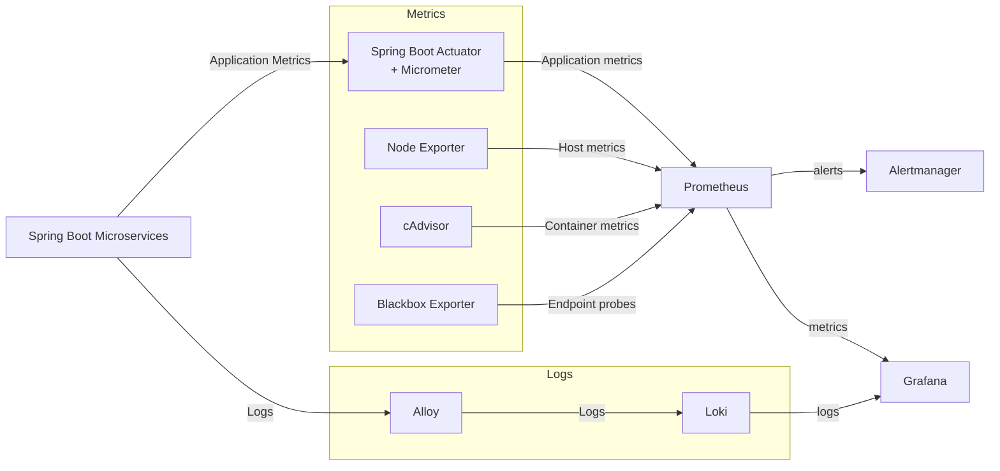

# Docker Swarm Monitoring

[🇷🇺 Русская версия](README_RU.md)

This project demonstrates the deployment and configuration of a monitoring and observability stack for a Java Spring Boot microservice application running on Docker Swarm.

The stack collects application, container, host, and endpoint metrics using Prometheus and exporters, while Grafana provides visualization and dashboards. Application logs are collected with Grafana Alloy and stored in Loki. Alertmanager is used to process and manage alerts based on Prometheus alerting rules.

The microservice application and Docker Swarm infrastructure are based on the [Docker Swarm Microservice Deployment](https://github.com/shchmxm/Docker-Swarm-Microservice-Deployment) project.

## Technologies

- Docker Swarm
- Prometheus
- Grafana
- Loki
- Grafana Alloy
- Alertmanager
- Node Exporter
- cAdvisor
- Blackbox Exporter
- Micrometer
- Spring Boot Actuator
- Vagrant
- Bash

## Implementation Highlights

- Added Micrometer and Spring Boot Actuator to the microservices for application-level metrics
- Added Node Exporter, Blackbox Exporter, and cAdvisor to the monitoring Swarm stack
- Configured Prometheus scrape jobs to collect metrics from the application and infrastructure
- Configured Grafana Alloy to collect container logs
- Deployed Loki as a centralized log storage system
- Created Grafana dashboards for application and infrastructure metrics
- Configured Alertmanager to process and manage Prometheus alerts
- Added Grafana and Alertmanager to the monitoring Swarm stack

## Architecture

**Monitoring Stack Topology**



**Container Distribution Across Nodes**

```text
┌───────────────────────────────┐
│ Manager Node                  │
│-------------------------------│
│ Microservice Stack            │
│   PostgreSQL                  │
│   RabbitMQ                    │
│   NGINX                       │
│                               │
│ Monitoring Stack              │
│   Prometheus                  │
│   Loki                        │
│   Grafana                     │
│   Alertmanager                │
│   Alloy                       │
│   Node Exporter               │
│   cAdvisor                    │
│   Blackbox Exporter           │
└───────────────────────────────┘

┌───────────────────────────────┐
│ Worker Node 1                 │
│-------------------------------│
│ Microservice Stack            │
│   Gateway Service             │
│   Session Service             │
│   Booking Service             │
│   Hotel Service               │
│   Payment Service             │
│   Loyalty Service             │
│   Report Service              │
│                               │
│ Monitoring Stack              │
│   Alloy                       │
│   Node Exporter               │
│   cAdvisor                    │
│   Blackbox Exporter           │
└───────────────────────────────┘

┌───────────────────────────────┐
│ Worker Node 2                 │
│-------------------------------│
│ Microservice Stack            │
│   Gateway Service             │
│   Session Service             │
│   Booking Service             │
│   Hotel Service               │
│   Payment Service             │
│   Loyalty Service             │
│   Report Service              │
│                               │
│ Monitoring Stack              │
│   Alloy                       │
│   Node Exporter               │
│   cAdvisor                    │
│   Blackbox Exporter           │
└───────────────────────────────┘
```

## Usage

**Requirements**

- At least 8 GB of RAM
- [VirtualBox](https://www.virtualbox.org/wiki/Downloads)
- [Vagrant](https://developer.hashicorp.com/vagrant/install)
- An email account and a Telegram bot for Alertmanager

**Step-by-step deployment**

1. Clone the repository and navigate to the project directory.

2. Make a copy of `monitoring_files/alertmanager.env.example` and name it `monitoring_files/alertmanager.env`:

```bash
cp monitoring_files/alertmanager.env.example monitoring_files/alertmanager.env
```
3. Replace the values in `alertmanager.env` with your own credentials.

4. Start the virtual machines using Vagrant:

```bash
vagrant up
```

5. Connect to the manager node:

```bash
vagrant ssh manager01
```

6. Deploy the microservice application stack:

```bash
docker stack deploy -c ./app_src/microservice_app_compose.yml microservice
```

Monitor the deployment status with:

```bash
docker stack ps microservice
```
7. After all containers are running, run the Postman API tests:

```bash
bash ./app_src/postman_tests/newman_run.sh
```

8. Deploy the monitoring stack:

```bash
docker stack deploy -c ./app_src/monitoring_compose.yml monitoring
```

Monitor the deployment status with:

```bash
docker stack ps monitoring
```

9. Access Grafana from your host machine:
[http://127.0.0.1:3000/](http://127.0.0.1:3000/)

The default login credentials are:
    login - `admin`
    password - `admin`

10. Add Prometheus and Loki as data sources in Grafana.
    - For Prometheus:
    Connections > Data Sources > Add New Datasource > Prometheus
    Set "Prometheus server URL" to: `http://prometheus:9090`

    - For Loki:
    Connections > Data Sources > Add New Datasource > Loki
    Set "Loki server URL" to: `http://loki:3100`

11. Import the dashboard from the repository to Grafana: 
    - Dashboard > New > Import > Upload dashboard JSON file 
    - Select file `monitoring_files/grafana_dashboard.json`
    - For Prometheus Datasource select "Prometheus"
    - For Loki Datasource select "Loki"
