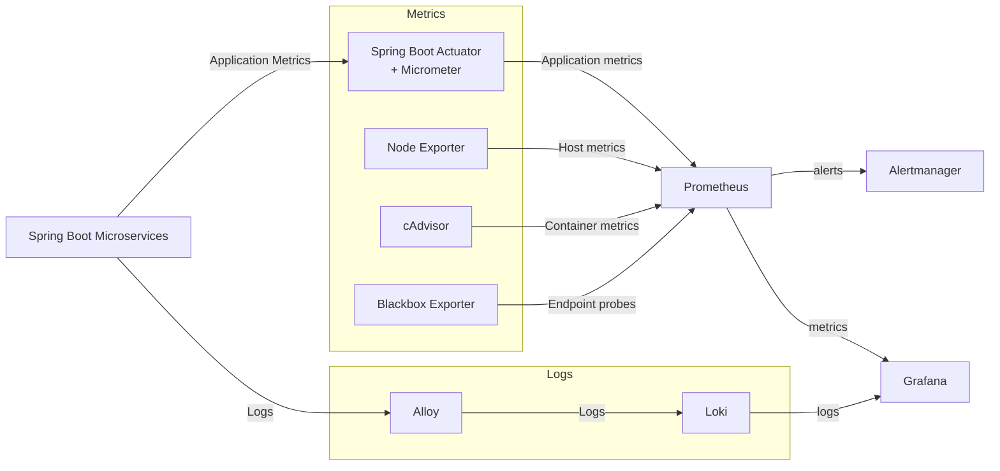

# Docker Swarm Monitoring

[🇬🇧English version](README.md)

Этот проект демонстрирует развёртывание и настройку стека мониторинга и наблюдаемости для Java Spring Boot микросервисного приложения, работающего в Docker Swarm.

Стек собирает метрики приложения, контейнеров, хостов и конечных точек с помощью Prometheus и exporters, а Grafana предоставляет визуализацию и дашборды. Логи приложения собираются с помощью Grafana Alloy и сохраняются в Loki. Alertmanager используется для обработки и управления алертами на основе правил оповещения Prometheus.

Микросервисное приложение и инфраструктура Docker Swarm основаны на проекте [Docker Swarm Microservice Deployment](https://github.com/shchmxm/Docker-Swarm-Microservice-Deployment).

## Используемые технологии

- Docker Swarm
- Prometheus
- Grafana
- Loki
- Grafana Alloy
- Alertmanager
- Node Exporter
- cAdvisor
- Blackbox Exporter
- Micrometer
- Spring Boot Actuator
- Vagrant
- Bash

## Шаги реализации

- Added Micrometer and Spring Boot Actuator to the microservices for application-level metrics
- Added Node Exporter, Blackbox Exporter, and cAdvisor to the monitoring Swarm stack
- Configured Prometheus scrape jobs to collect metrics from the application and infrastructure
- Configured Grafana Alloy to collect container logs
- Deployed Loki as a centralized log storage system
- Created Grafana dashboards for application and infrastructure metrics
- Configured Alertmanager to process and manage Prometheus alerts
- Added Grafana and Alertmanager to the monitoring Swarm stack

## Архитектура

**Топология стека мониторинга**



**Распределение контейнеров между нодами**

```text
┌───────────────────────────────┐
│ Manager Node                  │
│-------------------------------│
│ Microservice Stack            │
│   PostgreSQL                  │
│   RabbitMQ                    │
│   NGINX                       │
│                               │
│ Monitoring Stack              │
│   Prometheus                  │
│   Loki                        │
│   Grafana                     │
│   Alertmanager                │
│   Alloy                       │
│   Node Exporter               │
│   cAdvisor                    │
│   Blackbox Exporter           │
└───────────────────────────────┘

┌───────────────────────────────┐
│ Worker Node 1                 │
│-------------------------------│
│ Microservice Stack            │
│   Gateway Service             │
│   Session Service             │
│   Booking Service             │
│   Hotel Service               │
│   Payment Service             │
│   Loyalty Service             │
│   Report Service              │
│                               │
│ Monitoring Stack              │
│   Alloy                       │
│   Node Exporter               │
│   cAdvisor                    │
│   Blackbox Exporter           │
└───────────────────────────────┘

┌───────────────────────────────┐
│ Worker Node 2                 │
│-------------------------------│
│ Microservice Stack            │
│   Gateway Service             │
│   Session Service             │
│   Booking Service             │
│   Hotel Service               │
│   Payment Service             │
│   Loyalty Service             │
│   Report Service              │
│                               │
│ Monitoring Stack              │
│   Alloy                       │
│   Node Exporter               │
│   cAdvisor                    │
│   Blackbox Exporter           │
└───────────────────────────────┘
```

## Порядок запуска

**Требования к системе**

- Не менее 8 GB оперативной памяти
- [VirtualBox](https://www.virtualbox.org/wiki/Downloads)
- [Vagrant](https://developer.hashicorp.com/vagrant/install)
- Учётная запись электронной почты и Telegram-бот для Alertmanager

**Пошаговое развертывание**

1. Клонируйте репозиторий и перейдите в директорию проекта.

2. Создайте копию `monitoring_files/alertmanager.env.example` и назовите её `monitoring_files/alertmanager.env`:

```bash
cp monitoring_files/alertmanager.env.example monitoring_files/alertmanager.env
```
3. Замените значения в `alertmanager.env` на собственные учётные данные

4. Запустите виртуальные машины с помощью Vagrant:

```bash
vagrant up
```

5. Подключитесь к Manager Node:

```bash
vagrant ssh manager01
```

6. Разверните стек микросервисного приложения:

```bash
docker stack deploy -c ./app_src/microservice_app_compose.yml microservice
```

Проверить статус развертывания стека можно с помощью:

```bash
docker stack ps microservice
```
7. После запуска всех контейнеров выполните API-тесты Postman:

```bash
bash ./app_src/postman_tests/newman_run.sh
```

8. Разверните стек мониторинга:

```bash
docker stack deploy -c ./app_src/monitoring_compose.yml monitoring
```

Проверить статус развертывания стека можно с помощью:

```bash
docker stack ps monitoring
```

9. Откройте Grafana с хост-машины:
[http://127.0.0.1:3000/](http://127.0.0.1:3000/)

Учётные данные по умолчанию:
    login - `admin`
    password - `admin`

10. Добавьте Prometheus и Loki в качестве источников данных в Grafana.
    - Для Prometheus:
    Connections > Data Sources > Add New Datasource > Prometheus
    Установите значение `Prometheus server URL`:
    http://prometheus:9090

    - Для Loki:
    Connections > Data Sources > Add New Datasource > Loki
    Установите значение `Loki server URL`:
    http://loki:3100

11. Импортируйте дашборд из репозитория в Grafana:
    Dashboard > New > Import > Upload dashboard JSON file
    Выберите файл `monitoring_files/grafana_dashboard.json`
    Для Prometheus Datasource выберите Prometheus
    Для Loki Datasource выберите Loki
